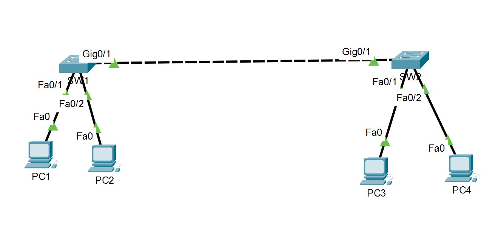

# Lab 01: VLANs and 802.1Q Trunking

## Overview

This lab demonstrates the configuration and troubleshooting of VLANs and 802.1Q trunking in a Cisco switched network.

The network uses two Cisco 2960 switches and four end devices. VLANs are used to create separate Layer 2 broadcast domains, while an 802.1Q trunk carries multiple VLANs between the switches.

A troubleshooting scenario was also performed by intentionally removing VLAN 10 from the trunk allowed VLAN list and diagnosing the resulting connectivity failure.

## Objectives

- Create and name VLANs on Cisco switches
- Configure access ports
- Assign switch ports to VLANs
- Configure an 802.1Q trunk between switches
- Control which VLANs are allowed across a trunk
- Verify VLAN and trunk operation
- Understand Layer 2 broadcast-domain separation
- Troubleshoot VLAN connectivity problems

## Topology



```text
PC1                         PC3
192.168.10.10               192.168.10.20
VLAN 10                     VLAN 10
   |                           |
 Fa0/1                       Fa0/1
   |                           |
  SW1 ===== Gi0/1 ===== Gi0/1 ===== SW2
   |          802.1Q Trunk           |
 Fa0/2                             Fa0/2
   |                                 |
PC2                               PC4
192.168.20.10                    192.168.20.20
VLAN 20                          VLAN 20
```

### VLAN Design

| VLAN | Name | Network |
|---|---|---|
| 10 | USERS | 192.168.10.0/24 |
| 20 | ADMIN | 192.168.20.0/24 |
| 99 | MANAGEMENT | 192.168.99.0/24 |

### End-Device Addressing

| Device | VLAN | IP Address | Subnet Mask |
|---|---:|---|---|
| PC1 | 10 | 192.168.10.10 | 255.255.255.0 |
| PC2 | 20 | 192.168.20.10 | 255.255.255.0 |
| PC3 | 10 | 192.168.10.20 | 255.255.255.0 |
| PC4 | 20 | 192.168.20.20 | 255.255.255.0 |

No default gateway is configured because this lab focuses on Layer 2 switching. Inter-VLAN routing will be implemented in a later lab.

## Switch Configuration

The VLANs were created on both switches:

```cisco
vlan 10
 name USERS

vlan 20
 name ADMIN

vlan 99
 name MANAGEMENT
```

Access ports were assigned to the appropriate VLANs.

### SW1

```cisco
interface FastEthernet0/1
 description PC1-USERS
 switchport mode access
 switchport access vlan 10

interface FastEthernet0/2
 description PC2-ADMIN
 switchport mode access
 switchport access vlan 20
```

### SW2

```cisco
interface FastEthernet0/1
 description PC3-USERS
 switchport mode access
 switchport access vlan 10

interface FastEthernet0/2
 description PC4-ADMIN
 switchport mode access
 switchport access vlan 20
```

## 802.1Q Trunk Configuration

GigabitEthernet0/1 was configured as the trunk between SW1 and SW2.

### SW1

```cisco
interface GigabitEthernet0/1
 description TRUNK-TO-SW2
 switchport mode trunk
 switchport trunk allowed vlan 10,20,99
```

### SW2

```cisco
interface GigabitEthernet0/1
 description TRUNK-TO-SW1
 switchport mode trunk
 switchport trunk allowed vlan 10,20,99
```

The trunk carries VLANs 10, 20, and 99 between the switches.

## Connectivity Verification

After configuring the trunk:

| Test | Result |
|---|---|
| PC1 → PC3 (VLAN 10) | Success |
| PC2 → PC4 (VLAN 20) | Success |
| PC1 → PC2 (VLAN 10 → VLAN 20) | Failed as expected |

PC1 cannot communicate directly with PC2 because they belong to different VLANs and different IP subnets. A Layer 3 device is required for inter-VLAN routing.

## Verification Commands

The following Cisco IOS commands were used to verify the configuration:

```cisco
show vlan brief
show interfaces trunk
show interfaces fa0/1 switchport
show interfaces fa0/2 switchport
show mac address-table
```

## Troubleshooting Scenario

### Problem

VLAN 10 hosts suddenly lost connectivity across the two switches while VLAN 20 continued working.

PC1 could no longer ping PC3:

```text
PC1 → PC3 = FAILED
```

However:

```text
PC2 → PC4 = SUCCESS
```

### Investigation

The trunk was inspected using:

```cisco
show interfaces trunk
```

The output showed:

```text
Vlans allowed on trunk
Gig0/1    20,99
```

The trunk itself was operational, but VLAN 10 was missing from the allowed VLAN list.

### Root Cause

VLAN 10 had been intentionally removed from the allowed VLAN list on SW1's GigabitEthernet0/1 trunk interface.

Because VLAN 10 was not permitted across the trunk, VLAN 10 traffic could not travel between SW1 and SW2.

VLAN 20 continued working because it was still allowed on the trunk.

### Resolution

VLAN 10 was restored:

```cisco
configure terminal
interface GigabitEthernet0/1
 switchport trunk allowed vlan 10,20,99
end
```

The trunk was verified again:

```cisco
show interfaces trunk
```

VLANs 10, 20, and 99 were now allowed.

PC1 was then able to successfully ping PC3 again.

## Key Lessons Learned

- VLANs create separate Layer 2 broadcast domains.
- Devices connected to the same physical switch can still be isolated by VLANs.
- Devices in the same VLAN can communicate across multiple switches when the VLAN is carried by a trunk.
- 802.1Q trunking allows multiple VLANs to traverse a single physical link.
- A trunk can remain operational even when a particular VLAN is accidentally removed from its allowed VLAN list.
- `show interfaces trunk` is an important command for diagnosing trunk-related VLAN connectivity problems.
- Communication between different VLANs requires Layer 3 routing.

## Tools Used

- Cisco Packet Tracer
- Cisco IOS CLI
- Git
- GitHub

## Security Notice

All IP addresses, configurations, devices, and topology information in this repository are from a synthetic lab environment. No employer, customer, government, or military production information is included.
