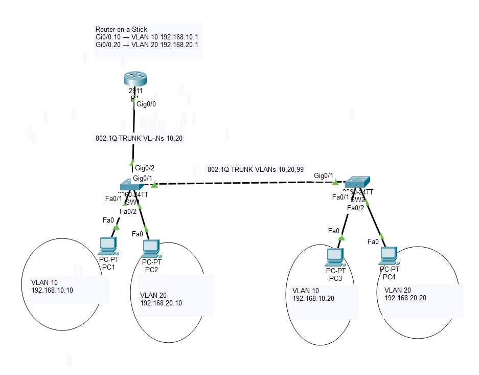

# Lab 02: Inter-VLAN Routing — Router-on-a-Stick

## Overview

This lab builds on the VLAN and 802.1Q trunking configuration from Lab 01 by introducing Layer 3 communication between VLANs.

A Cisco router was connected to SW1 and configured using the **Router-on-a-Stick (ROAS)** design. Router subinterfaces provide default gateways for VLAN 10 and VLAN 20, allowing devices in different VLANs and IP subnets to communicate.

A troubleshooting scenario was also performed by intentionally breaking the VLAN 20 router subinterface, diagnosing the resulting connectivity failure, and restoring service.

## Objectives

- Understand why communication between VLANs requires Layer 3 routing
- Configure Router-on-a-Stick
- Configure Cisco router subinterfaces
- Configure 802.1Q encapsulation on router subinterfaces
- Configure default gateways for VLAN hosts
- Verify directly connected and local routes
- Test inter-VLAN connectivity
- Troubleshoot a failed router subinterface
- Use a structured troubleshooting methodology

## Topology


The Topology uses on router, two layer 2 switchtes, and four end devices. 

```text
                         R1
                       Gi0/0
                         |
                   802.1Q Trunk
                         |
                      SW1 Gi0/2
                         |
               +---------+---------+
               |                   |
            VLAN 10             VLAN 20
               |                   |
              PC1                 PC2
       192.168.10.10       192.168.20.10
       GW 192.168.10.1     GW 192.168.20.1
               |                   |
               +------ SW1 --------+
                         |
                    Gi0/1 Trunk
                         |
                    Gi0/1 SW2
                    /         \
                 VLAN 10     VLAN 20
                    |           |
                   PC3         PC4
            192.168.10.20   192.168.20.20
            GW .10.1        GW .20.1
```

## VLAN and IP Addressing

| VLAN | Name | Network | Default Gateway |
|---|---|---|---|
| 10 | USERS | 192.168.10.0/24 | 192.168.10.1 |
| 20 | ADMIN | 192.168.20.0/24 | 192.168.20.1 |
| 99 | MANAGEMENT | 192.168.99.0/24 | Not configured in this lab |

### End Devices

| Device | VLAN | IP Address | Subnet Mask | Default Gateway |
|---|---:|---|---|---|
| PC1 | 10 | 192.168.10.10 | 255.255.255.0 | 192.168.10.1 |
| PC2 | 20 | 192.168.20.10 | 255.255.255.0 | 192.168.20.1 |
| PC3 | 10 | 192.168.10.20 | 255.255.255.0 | 192.168.10.1 |
| PC4 | 20 | 192.168.20.20 | 255.255.255.0 | 192.168.20.1 |

## Router-on-a-Stick Design

The physical interface `GigabitEthernet0/0` on R1 is connected to `GigabitEthernet0/2` on SW1.

The physical router interface does not require an IP address:

```cisco
interface GigabitEthernet0/0
 no ip address
 no shutdown
```

Instead, two logical subinterfaces were created.

### VLAN 10 Subinterface

```cisco
interface GigabitEthernet0/0.10
 encapsulation dot1Q 10
 ip address 192.168.10.1 255.255.255.0
```

### VLAN 20 Subinterface

```cisco
interface GigabitEthernet0/0.20
 encapsulation dot1Q 20
 ip address 192.168.20.1 255.255.255.0
```

The subinterface numbers `.10` and `.20` correspond to VLANs 10 and 20 for readability. The VLAN association itself is established by the `encapsulation dot1Q` command.

## SW1 Router Trunk

SW1 `GigabitEthernet0/2` was configured as an 802.1Q trunk toward R1:

```cisco
interface GigabitEthernet0/2
 description TRUNK-TO-R1
 switchport mode trunk
 switchport trunk allowed vlan 10,20
```

SW1 therefore has two trunk links:

```text
Gi0/1 → Trunk to SW2 → VLANs 10,20,99
Gi0/2 → Trunk to R1  → VLANs 10,20
```

The SW1-to-SW2 trunk transports VLAN traffic between switches.

The SW1-to-R1 trunk transports VLAN 10 and VLAN 20 traffic to the router for Layer 3 routing.

## Routing Table Verification

The router configuration was verified using:

```cisco
show ip interface brief
show ip route
```

R1 learned the VLAN networks as directly connected routes:

```text
C 192.168.10.0/24 is directly connected, GigabitEthernet0/0.10
L 192.168.10.1/32 is directly connected, GigabitEthernet0/0.10

C 192.168.20.0/24 is directly connected, GigabitEthernet0/0.20
L 192.168.20.1/32 is directly connected, GigabitEthernet0/0.20
```

`C` represents a **directly connected network**.

`L` represents the router's own **local interface address**. Cisco IOS installs these addresses as `/32` local routes.

No static or dynamic routing protocol was required because both VLAN networks are directly connected to R1.

## Inter-VLAN Packet Flow

When PC1 (`192.168.10.10`) communicates with PC2 (`192.168.20.10`), PC1 determines that the destination is outside its local `192.168.10.0/24` subnet.

PC1 therefore sends the packet toward its default gateway:

```text
192.168.10.1
```

The traffic follows this path:

```text
PC1
192.168.10.10
     |
     | VLAN 10
     v
SW1
     |
     | 802.1Q VLAN 10
     v
R1 Gi0/0.10
192.168.10.1
     |
     | Layer 3 Routing
     v
R1 Gi0/0.20
192.168.20.1
     |
     | 802.1Q VLAN 20
     v
SW1
     |
     | VLAN 20
     v
PC2
192.168.20.10
```

The switch provides Layer 2 forwarding within VLANs, while R1 performs Layer 3 routing between the two IP networks.

## Connectivity Verification

After configuring the router and host default gateways, the following tests succeeded:

| Test | Purpose | Result |
|---|---|---|
| PC1 → 192.168.10.1 | Test VLAN 10 default gateway | Success |
| PC2 → 192.168.20.1 | Test VLAN 20 default gateway | Success |
| PC1 → 192.168.20.10 | Test VLAN 10 to VLAN 20 routing | Success |

This confirmed that Router-on-a-Stick was operating correctly.

## Troubleshooting Scenario

### Problem

The VLAN 20 router subinterface was intentionally disrupted.

After the fault was introduced:

```text
PC1 → 192.168.10.1   SUCCESS
PC2 → 192.168.20.1   FAILED
PC1 → 192.168.20.10  FAILED
```

When PC1 attempted to reach PC2, the router returned:

```text
Reply from 192.168.10.1: Destination host unreachable.
```

This indicated that PC1 could successfully reach R1 through VLAN 10, but R1 could no longer forward traffic toward the VLAN 20 network.

### Investigation

The following commands were used:

```cisco
show ip interface brief
show ip route
show running-config
```

Inspection of the router configuration showed:

```cisco
interface GigabitEthernet0/0.10
 encapsulation dot1Q 10
 ip address 192.168.10.1 255.255.255.0

interface GigabitEthernet0/0.20
 no ip address
```

The VLAN 20 subinterface no longer had its required 802.1Q encapsulation and Layer 3 address.

### Root Cause

The VLAN 20 Router-on-a-Stick subinterface configuration had been disrupted, preventing R1 from providing the `192.168.20.1` gateway and routing traffic into the `192.168.20.0/24` network.

### Resolution

The VLAN 20 subinterface configuration was restored:

```cisco
configure terminal

interface GigabitEthernet0/0.20
 encapsulation dot1Q 20
 ip address 192.168.20.1 255.255.255.0

end
```

Verification commands were run again:

```cisco
show ip interface brief
show ip route
```

The connected and local VLAN 20 routes returned.

Connectivity testing then confirmed:

```text
PC2 → 192.168.20.1   SUCCESS
PC1 → 192.168.20.10  SUCCESS
```

## Troubleshooting Methodology

The troubleshooting process followed this sequence:

```text
1. Identify the symptom
        |
2. Test the local default gateway
        |
3. Determine which VLAN/network is affected
        |
4. Inspect router interface status
        |
5. Inspect the routing table
        |
6. Inspect the subinterface configuration
        |
7. Identify the root cause
        |
8. Restore the configuration
        |
9. Verify routing
        |
10. Retest end-to-end connectivity
```

## Key Lessons Learned

- VLANs separate Layer 2 broadcast domains.
- A Layer 3 device is required for communication between different VLANs.
- Router-on-a-Stick allows one physical router interface to route multiple VLANs.
- Router subinterfaces use 802.1Q encapsulation to associate traffic with specific VLANs.
- Hosts require the correct default gateway to communicate with remote IP networks.
- The physical router interface can remain unnumbered while its subinterfaces contain the Layer 3 gateway addresses.
- Directly connected networks appear with `C` in the Cisco routing table.
- Router interface addresses appear as `/32` local (`L`) routes.
- A successful ping to the local gateway but failure to reach another VLAN can help isolate the problem to routing or the destination-side network.
- `show ip interface brief`, `show ip route`, and `show running-config` are valuable commands for diagnosing Router-on-a-Stick problems.

## Verification Commands

```cisco
show ip interface brief
show ip route
show vlan brief
show interfaces trunk
show mac address-table
show running-config
```

## Tools Used

- Cisco Packet Tracer
- Cisco IOS CLI
- Git
- GitHub

## Security Notice

All IP addresses, device configurations, and topology information in this repository were created in a synthetic lab environment for educational purposes. No employer, customer, government, or military production information is included.
